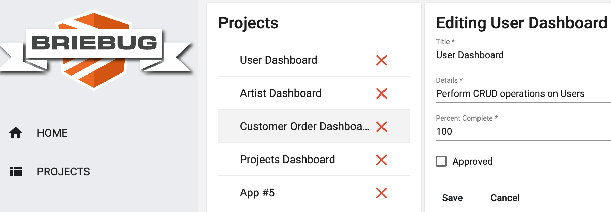

# Project Dashboard

This project was generated using [Nx](https://nx.dev).



## App Description

This is the 4th of 8 Accelerated Angular LevelUp Applications.
It served as a litmus test for my individual progress since the LevelUp began. Additionally, this project aimed to show a basic feature set for a fully reactive, unit tested, well architected Angular application.

Specifically, this dashboard app features CRUD functionality on a Project entitiy -

```json
  "projects": [
    {
      "id": "965f68e6-b1f9-4321-b583-97798c9cb03c",
      "title": "User Dashboard",
      "details": "Perform CRUD operations on Users",
      "percentComplete": 100,
      "approved": false
    },
    {
      "id": "e8f6945a-f059-4f5d-ad7c-6b3763d92a70",
      "title": "Artist Dashboard",
      "details": "Perform CRUD operations on Artists",
      "percentComplete": 90,
      "approved": false
    }
  ]
```

The home page shows all projects and their current property values.

## Getting Started

Run `npm install`.

## Development server

Run `npm run serve:all` for a dev server and to run the json-server api. Navigate to http://localhost:4200/. The app will automatically reload if you change any of the source files.

## Build

Run `ng build dashboard` to build the project. The build artifacts will be stored in the `dist/` directory. Use the `--prod` flag for a production build.

## Understand your workspace

Run `nx dep-graph` to see a diagram of the dependencies of your projects.
